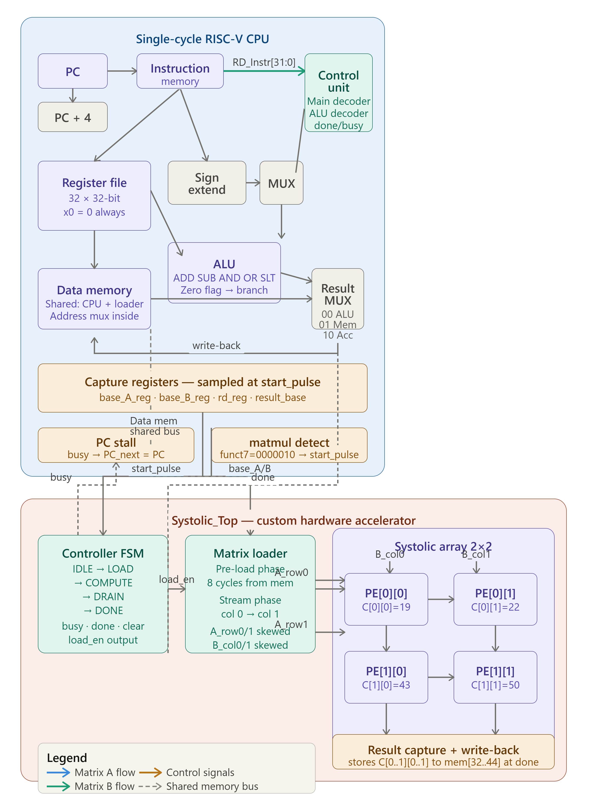
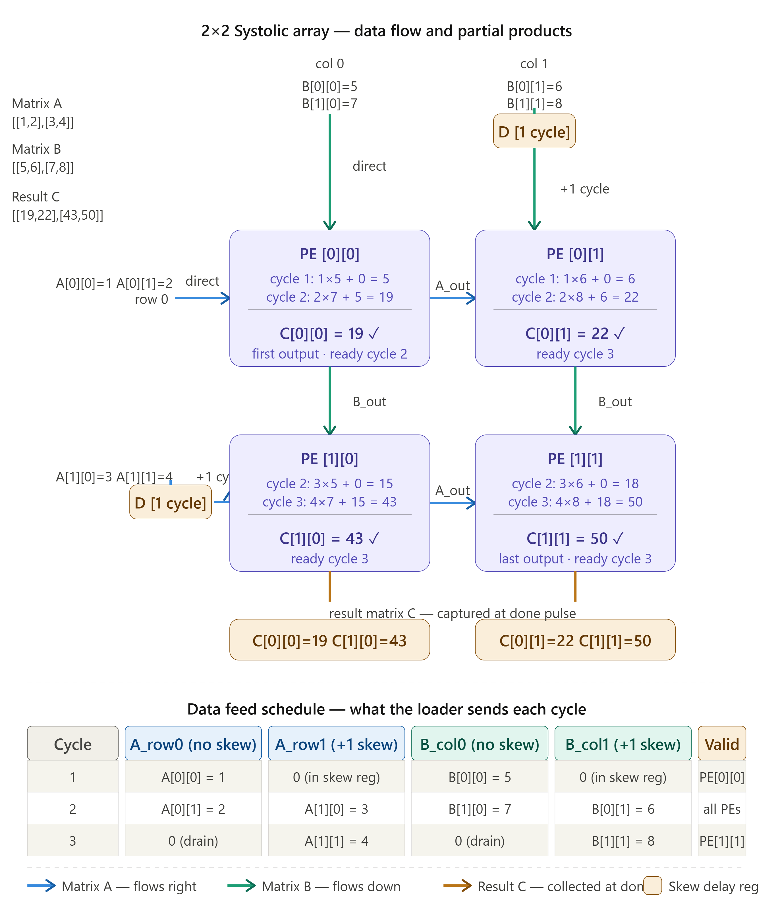
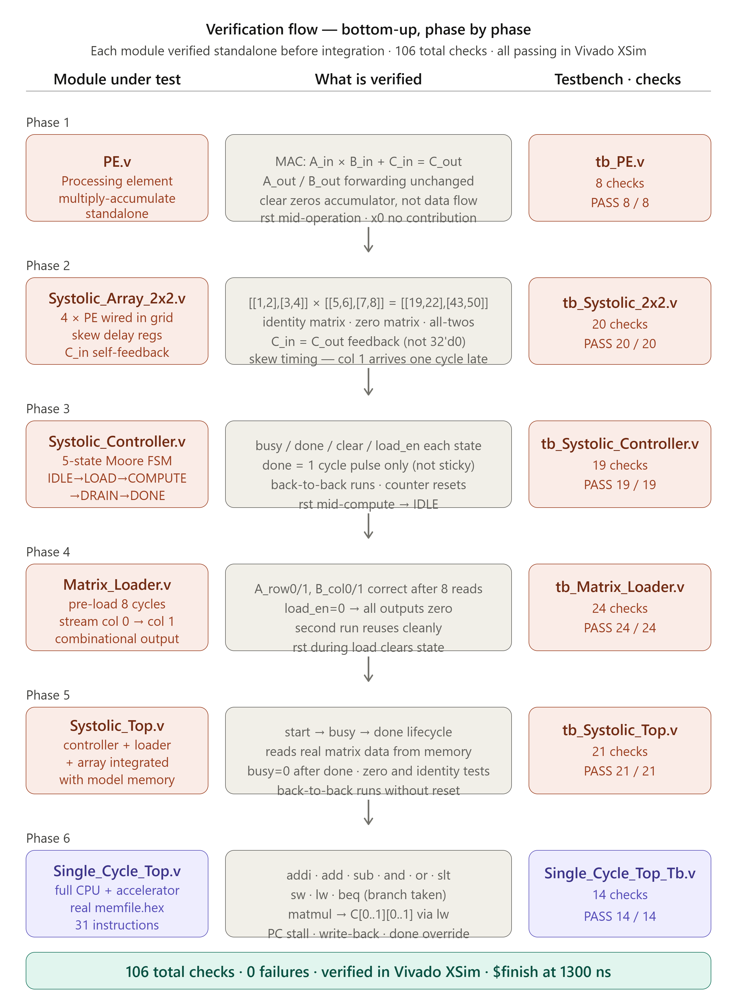
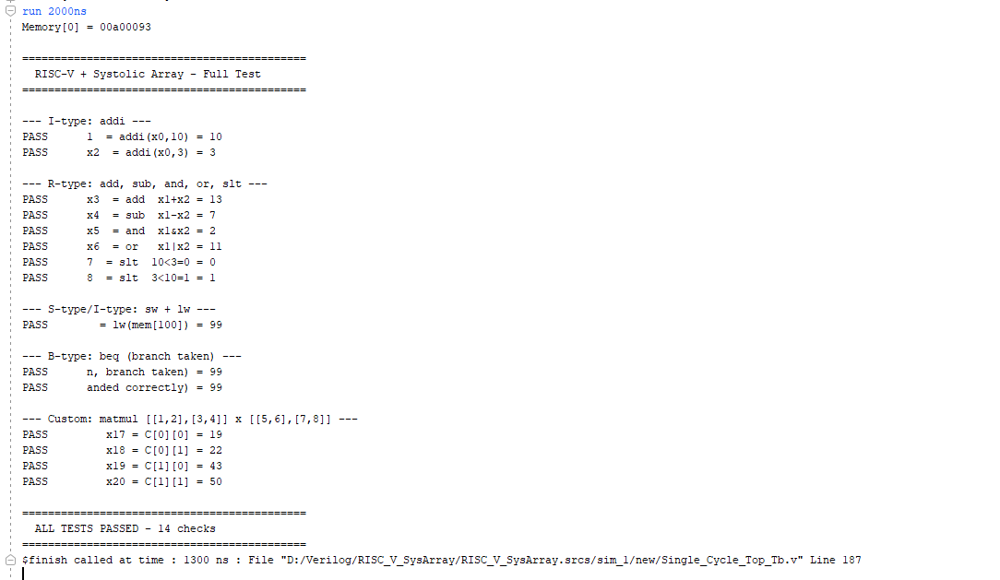
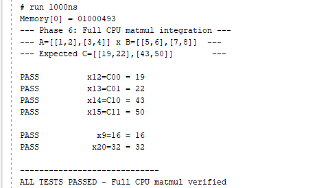
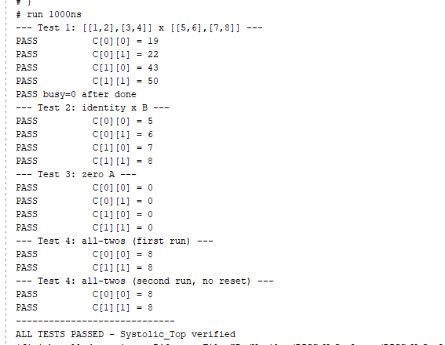

# RISC-V Processor with Systolic Array Accelerator

A custom Single-Cycle RISC-V Processor implemented in Verilog HDL and extended with a custom 2×2 Systolic Array Matrix Multiplication Accelerator. The project demonstrates processor design, custom instruction integration, RTL development, verification, and hardware acceleration concepts for matrix-based computations.

---

## Project Overview

This project combines a standard Single-Cycle RISC-V processor with a custom hardware accelerator designed using a systolic array architecture. A dedicated matrix multiplication instruction enables the processor to offload computationally intensive operations to the accelerator.

The design includes:

- Single-Cycle RISC-V CPU
- Custom Instruction Support
- 2×2 Systolic Array Accelerator
- Matrix Loader and Controller
- Integrated Memory Subsystem
- Complete RTL Verification Environment
- Functional Simulation and Waveform Analysis

---

## System Architecture

### Complete RISC-V + Systolic Array Architecture



### Systolic Array Architecture



---

## Key Features

### RISC-V Processor

- Single-Cycle Architecture
- R-Type Instructions
  - ADD
  - SUB
  - AND
  - OR
  - SLT
- I-Type Instructions
  - ADDI
- Memory Operations
  - LW
  - SW
- Branch Operations
  - BEQ

### Custom Accelerator

- Custom Matrix Multiplication Instruction
- 2×2 Systolic Array Architecture
- Parallel Processing Elements (PEs)
- Matrix Loader Interface
- Dedicated Systolic Controller
- Hardware-Accelerated Matrix Computation

### Verification

- Module-Level Verification
- Accelerator Verification
- Full CPU Integration Verification
- Functional Waveform Analysis

---

## RTL Design Hierarchy

### Processor Modules

- PC_Module
- PC_Adder
- Instruction_Memory
- Register_File
- Sign_Extend
- Main_Decoder
- ALU_Decoder
- ALU
- Data_Memory
- Mux
- Control_Unit_Top

### Accelerator Modules

- PE
- Systolic_Array_2x2
- Matrix_Loader
- Systolic_Controller
- Systolic_Top

### Top-Level Integration

- Single_Cycle_Top

---

## Verification Methodology

The project was verified using dedicated testbenches for individual modules and complete system integration.

### Verified Components

- Processing Element (PE)
- Systolic Array
- Matrix Loader
- Systolic Controller
- Systolic Top
- Full CPU Integration

### Verification Flow



---

## Verification Results

### Full CPU Integration Verification



### Matrix Multiplication Verification



### Systolic Array Verification



### Summary

| Module | Result |
|----------|----------|
| Processing Element (PE) | 8 / 8 PASS |
| Systolic Array | 20 / 20 PASS |
| Systolic Controller | 19 / 19 PASS |
| Matrix Loader | 24 / 24 PASS |
| Systolic Top | 21 / 21 PASS |
| Full System Integration | 14 / 14 PASS |

**Total Verification Checks Passed: 106**

**Verification Success Rate: 100%**

---

## Waveform Results

The repository includes waveform captures for:

- Systolic Top Verification
- Full CPU Integration
- Final Matrix Multiplication Execution

Available in:

```text
waveforms/
```

---

## Project Metrics

| Metric | Value |
|----------|----------|
| RTL Modules | 16 |
| Testbenches | 6 |
| Verification Checks Passed | 106 |
| Processor Type | Single-Cycle RISC-V |
| Accelerator Type | 2×2 Systolic Array |
| Language | Verilog HDL |
| Simulation Tool | Xilinx Vivado Simulator |
| Waveform Analysis | Xilinx Vivado Waveform Viewer |
| Custom Instruction Support | Yes |
| Verification Status | Fully Verified |

---

## Repository Structure

```text
riscv-systolic-array-processor
│
├── rtl/
│   └── Verilog RTL source files
│
├── testbench/
│   └── Verification testbenches
│
├── assembly/
│   ├── memfile.hex
│   └── Test program files
│
├── images/
│   └── Architecture diagrams
│
├── waveforms/
│   └── Simulation waveforms
│
├── results/
│   ├── Verification outputs
│   ├── Project metrics
│   └── Verification summary
│
├── docs/
│   └── Technical project report
│
└── README.md
```

---

## Tools Used

### Design

- Verilog HDL

### Simulation

- Xilinx Vivado Simulator

### Waveform Analysis

- Xilinx Vivado Waveform Viewer

### Documentation

- GitHub
- Markdown

---

## Future Work

- FPGA Implementation and Hardware Validation
- Performance Analysis and Benchmarking
- Larger Systolic Array Architectures
- Multi-Cycle/Pipelined RISC-V Integration
- Custom ISA Extension Expansion
- Accelerator Performance Optimization

---

## Author

**Tanay Srivastava**

Electronics Engineering (VLSI Design)

Areas of Interest:

- RTL Design
- Digital IC Design
- FPGA Development
- ASIC Design Flow
- Verification
- Computer Architecture
- RISC-V Processor Design
